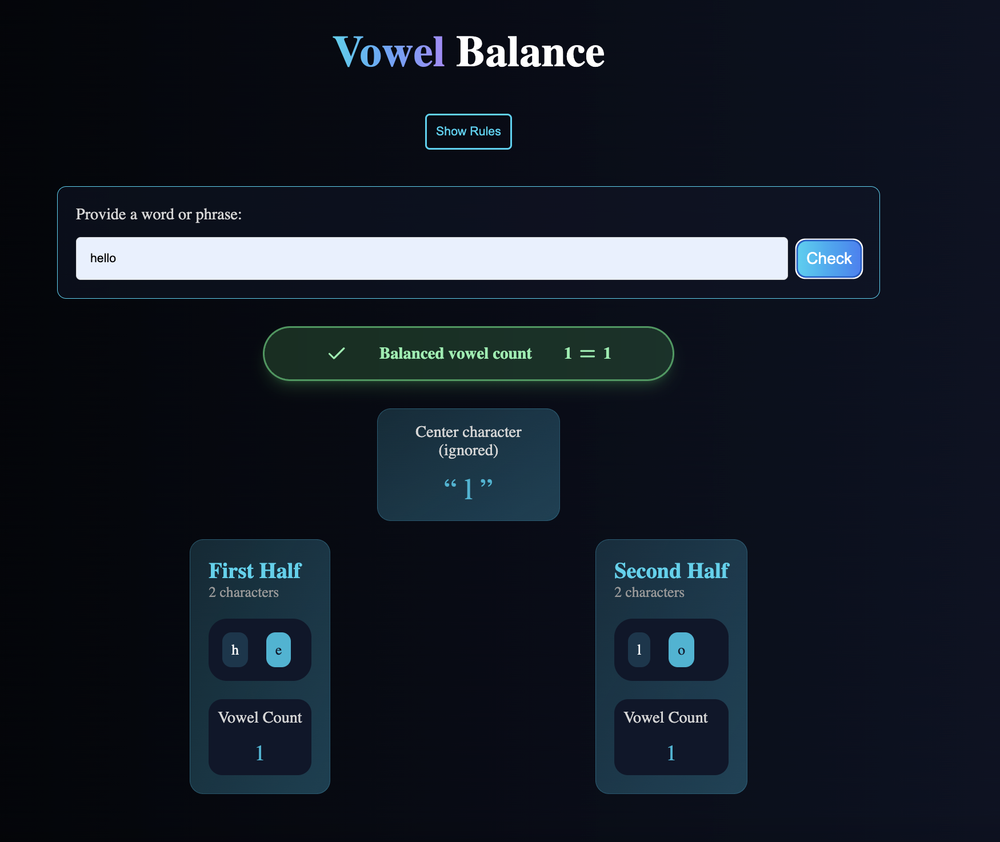
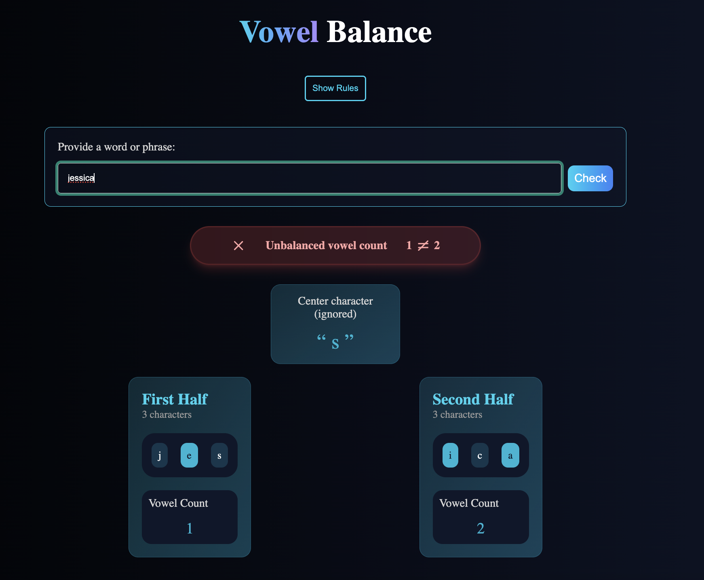

# Vowel Balance

This project was inspired by [freeCodeCamp's August 11th, 2025 daily coding challenge](https://www.freecodecamp.org/learn/daily-coding-challenge/2025-08-11).

## Rules

Provide a word or phrase and check whether the number of vowels in the first half of the string is equal to the number of vowels in the second half.

- The string can contain any characters.
- The letters a, e, i, o, and u, in either uppercase or lowercase, are considered vowels.
- If there's an odd number of characters in the string, ignore the center character.

